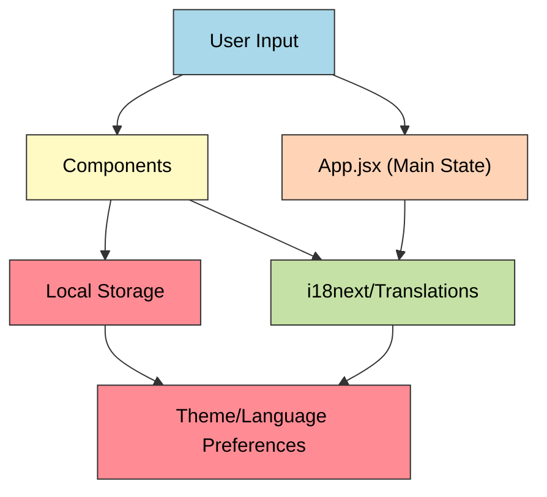
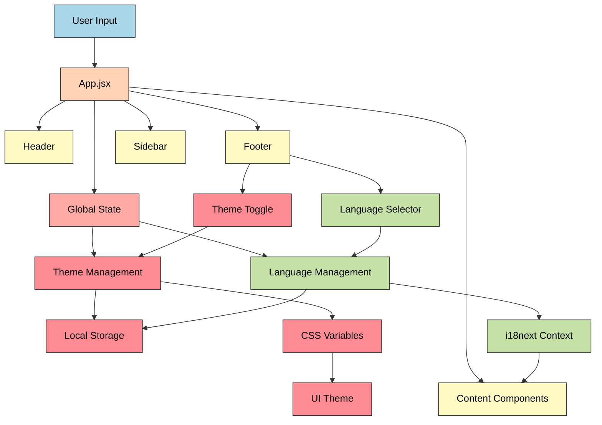

# Multi-Language Personal Portfolio with Dark Mode

A modern, responsive portfolio website that showcases projects and professional experience in four languages with seamless dark/light mode switching. Built with React and i18next for internationalization.

This portfolio website provides a professional platform for displaying projects and skills with a focus on user experience and accessibility. It features a clean, modern design with smooth transitions between light and dark modes, multi-language support for English, Spanish, French, and Portuguese, and responsive layouts that work across all devices. The application uses React for component-based architecture and i18next for comprehensive internationalization support.

## Repository Structure
```
.
├── public/               # Static files and deployment configurations
│   ├── _redirects        # Netlify redirect rules for SPA routing
│   └── robots.txt        # Search engine crawling rules
├── src/                  # Application source code
│   ├── components/       # Reusable React components (header, footer, sidebar)
│   ├── locales/          # Translation files for i18next (en, es, fr, pt)
│   ├── pages/            # Page components (HomePage, Project, PageNotFound)
│   ├── styles/           # CSS modules for component styling
│   ├── App.jsx           # Main application component
│   └── main.jsx          # Application entry point
└── package.json          # Project dependencies and scripts
```

## Usage Instructions
### Prerequisites
- Node.js (version 14 or higher)
- npm (Node Package Manager)
- Git

### Installation
```bash
# Clone the repository
git clone <repository-url>

# Navigate to project directory
cd portfolio

# Install dependencies
npm install
```

### Quick Start
1. Start the development server:
```bash
npm run dev
```

2. Open your browser and navigate to `http://localhost:5173`

3. To build for production:
```bash
npm run build
```

### More Detailed Examples

#### Language Switching
```javascript
// Using the language selector in the footer
const handleLanguageChange = (newLang) => {
    i18n.changeLanguage(newLang);
    setSelectedLanguage(newLang);
}
```

#### Theme Switching
```javascript
// Toggle between light and dark mode
const [isDark, setIsDark] = useLocalStorage('isDark', preference);
const toggleDarkMode = () => setIsDark(!isDark);
```

### Troubleshooting

#### Common Issues

1. Page Not Loading
- **Problem**: White screen after deployment
- **Solution**: Check if the `_redirects` file is properly configured in the `public` directory
```
/* /index.html 200
```

2. Language Not Switching
- **Problem**: Content remains in the same language after selection
- **Solution**: Verify that translation files exist in `src/locales/<lang>/translation.json`
- Check browser console for missing translation keys

3. Dark Mode Not Persisting
- **Problem**: Theme resets on page refresh
- **Solution**: Verify local storage permissions in your browser
- Check if `useLocalStorage` hook is properly implemented

#### Debug Mode
To enable debug mode for i18next:
```javascript
i18next.init({
  debug: true,
  // other config
});
```

## Data Flow

The application follows a component-based architecture with centralized state management for theme and language preferences.



Key component interactions:
1. App.jsx manages global state for theme and routing
2. Header component handles navigation and branding
3. Footer manages language selection and theme toggle
4. Sidebar provides project navigation
5. Content components render based on selected language
6. Theme changes trigger CSS variable updates
7. Language changes trigger i18next context updates


## Application Flow Diagram

